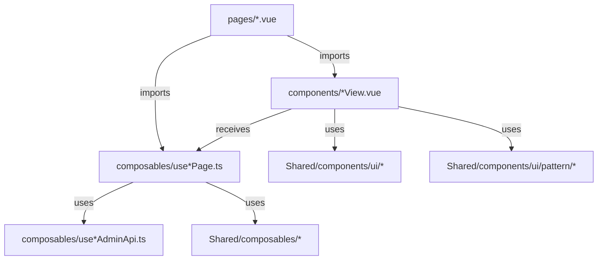
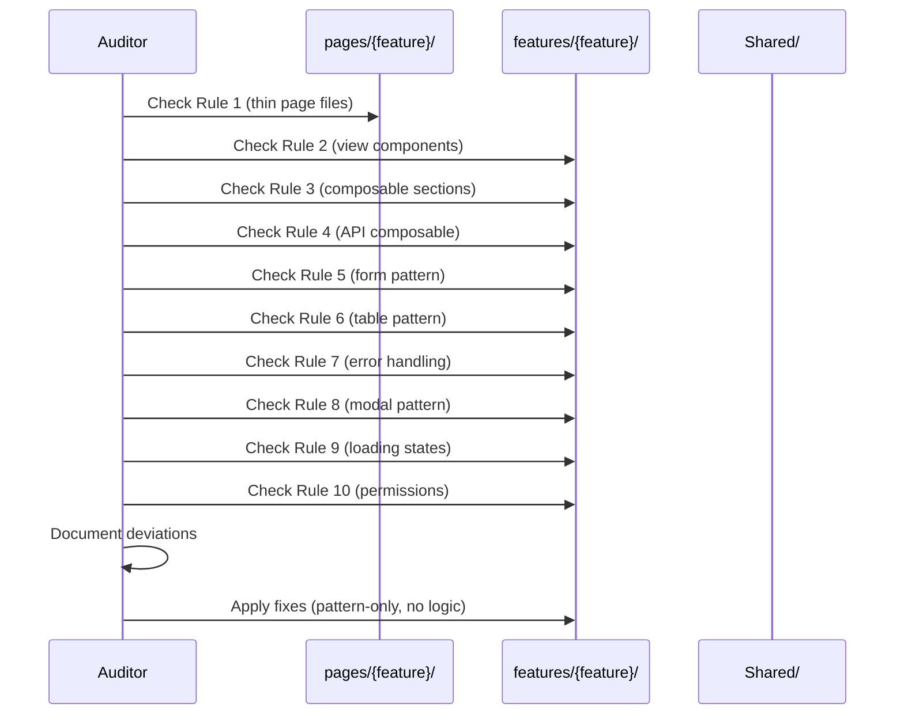

# Design Document: UI and Code Pattern Audit

## Overview

This audit ensures all 18 features in the Lumora.FE.Admin project conform to the established patterns demonstrated by the categories feature. The scope is strictly limited to UI/code pattern alignment — no logic changes, no functionality changes. Each feature is checked against 10 pattern rules covering page files, view components, composables, API composables, forms, tables, error handling, modals, loading states, and permissions.

## Architecture

The project follows a layered feature-module architecture where each feature lives in `features/{name}/` with three subdirectories: `components/`, `composables/`, and `types/`. Pages in `pages/` are ultra-thin delegates that wire composables to view components.



## Audit Checklist (10 Pattern Rules)

### Rule 1: Thin Page Pattern

**Expected pattern** (pages/*.vue):
```typescript
<script setup lang="ts">
import { useFeaturePage } from "~/features/{feature}/composables/useFeaturePage";
import FeatureView from "~/features/{feature}/components/FeatureView.vue";

const page = await useFeaturePage();
</script>

<template>
  <FeatureView :page="page" />
</template>
```

**Violations to detect**:
- Inline logic beyond the single composable call
- Direct API calls in page files
- Template content beyond the single view component
- Missing `await` on composable call

### Rule 2: View Component Pattern

**Expected pattern** (components/*View.vue):
```typescript
<script setup lang="ts">
import type { FeaturePageState } from "~/features/{feature}/composables/useFeaturePage";

const props = defineProps<{ page: FeaturePageState }>();
const { /* destructured state */ } = props.page;
</script>

<template>
  <AppIndexPage ...> or <AppDetailPage ...> or <AppPanel ...>
</template>
```

**Violations to detect**:
- View components not receiving a single `page` prop
- View components not using AppIndexPage/AppDetailPage/AppPanel as root pattern
- Direct API calls or data fetching in view components
- Missing type import for page state

### Rule 3: Page Composable Numbered Sections

**Expected pattern** (composables/use*Page.ts):
```typescript
export const useFeaturePage = async () => {
  // 1. Dependency injection
  // 2. Permissions
  // 3. Pagination (usePagination)
  // 4. Filters (useFilters)
  // 5. Data fetching (useAsyncData)
  // 6. Computed derivations
  // 7. Actions/mutations
  // 8. Watchers
  // 9. Return statement
};

export type FeaturePageState = Awaited<ReturnType<typeof useFeaturePage>>;
```

**Violations to detect**:
- Missing numbered section comments
- Sections out of order
- Missing type export at bottom
- Non-async composable (should use `async` + `await useAsyncData`)

### Rule 4: API Composable Pattern

**Expected pattern** (composables/use*AdminApi.ts):
```typescript
const featureRoute = (path = "") => `/feature${path}`;
const featureItemRoute = (id: string, subPath = "") => `/feature/${id}${subPath}`;

export const useFeatureAdminApi = () => {
  const api = useApiClient();

  return {
    getItems: (page = 1, size = 50) =>
      api.request<PaginatedResponse<ItemResponse>>(
        `${featureRoute()}${toSearchParams({ page, size })}`,
      ),
    // ... typed methods
  };
};
```

**Violations to detect**:
- Missing route helper functions at top
- Methods not returning typed `api.request<T>()` calls
- Not using `toSearchParams()` for query strings
- Inline URL construction without route helpers

### Rule 5: Form Pattern

**Expected pattern**:
```html
<form class="form-stack" @submit.prevent="handleSubmit">
  <AppInput label="..." v-model="..." />
  <AppSelect label="..." v-model="..." :options="..." />
  <AppTextarea label="..." v-model="..." />
  <AppButton type="submit" variant="primary" :loading="...">Save</AppButton>
</form>
```

**Violations to detect**:
- Forms not using `form-stack` class
- Raw `<input>`, `<select>`, `<textarea>` instead of App* components
- Missing `@submit.prevent` on form elements
- Submit buttons not using AppButton with variant="primary"

### Rule 6: Table Pattern

**Expected pattern**:
```html
<table class="data-table">
  <thead><tr><th>...</th></tr></thead>
  <tbody>
    <tr v-for="item in items" :key="item.id">
      <td><p class="table-title">{{ item.name }}</p><p class="table-copy">{{ item.detail }}</p></td>
      <td><AppBadge :tone="...">{{ status }}</AppBadge></td>
    </tr>
  </tbody>
</table>
```

**Violations to detect**:
- Tables not using `data-table` class
- Missing `table-title` / `table-copy` classes for cell text
- Status columns not using AppBadge
- Missing proper `thead`/`tbody` structure

### Rule 7: Error Handling Pattern

**Expected pattern**:
```typescript
// In composable
const actionError = ref("");
// In catch blocks:
actionError.value = getProblemMessage(requestError, "Fallback message.");
```

```html
<!-- In view (handled by AppIndexPage action-error prop or manual) -->
<AppNotice v-if="actionError" tone="danger" :title="...">{{ actionError }}</AppNotice>
```

**Violations to detect**:
- Direct `error.message` usage instead of `getProblemMessage()`
- Missing fallback message in `getProblemMessage()` calls
- Error display not using AppNotice with tone="danger"
- Missing `actionError` ref for mutation error tracking

### Rule 8: Modal/Confirmation Pattern

**Expected pattern**:
```html
<AppConfirm
  :open="showConfirm"
  title="Confirm action?"
  detail="Description of what will happen."
  confirm-label="Confirm"
  :tone="'danger'"
  :loading="actionPending"
  @confirm="handleConfirm"
  @cancel="handleCancel"
/>
```

**Violations to detect**:
- Custom modal implementations instead of AppConfirm
- Missing loading state on confirm actions
- Missing tone prop for destructive actions

### Rule 9: Loading State Pattern

**Expected pattern**:
```html
<!-- Skeleton loading (handled by AppIndexPage/AppDetailPage internally, or manual) -->
<div v-if="pending" class="soft-card animate-pulse">...</div>
```

**Violations to detect**:
- Custom spinner implementations where soft-card skeleton should be used
- Missing loading indicators during data fetch
- Not leveraging AppIndexPage/AppDetailPage built-in loading handling

### Rule 10: Permission Pattern

**Expected pattern**:
```typescript
// In composable
const authz = useAdminAuthorization();
const canDoThing = computed(() => authz.can(ADMIN_PERMISSION.featureActionScope));
```

```html
<!-- In view -->
<th v-if="canDoThing">...</th>
<AppButton v-if="canDoThing" ...>Action</AppButton>
```

**Violations to detect**:
- Direct permission string checks instead of `useAdminAuthorization().can()`
- Permission checks in view components instead of composable
- Missing permission guards on action columns/buttons
- Missing `ADMIN_PERMISSION` enum usage

## Features to Audit

The following 18 features will be audited against all 10 rules:

| # | Feature | Pages Dir | Feature Dir |
|---|---------|-----------|-------------|
| 1 | auth | pages/auth/ | features/auth/ |
| 2 | categories | pages/categories/ | features/categories/ |
| 3 | coupons | pages/coupons/ | features/coupons/ |
| 4 | dashboard | pages/index.vue | features/dashboard/ |
| 5 | inventory | pages/inventory/ | features/inventory/ |
| 6 | operations | pages/system-events/ | features/operations/ |
| 7 | orders | pages/orders/ | features/orders/ |
| 8 | payments | pages/payments/ | features/payments/ |
| 9 | permissions | pages/permissions/ | features/permissions/ |
| 10 | products | pages/products/ | features/products/ |
| 11 | profile | pages/profile/ | features/profile/ |
| 12 | reviews | pages/reviews/ | features/reviews/ |
| 13 | roles | pages/roles/ | features/roles/ |
| 14 | sessions | pages/sessions/ | features/sessions/ |
| 15 | settings | pages/settings/ | features/settings/ |
| 16 | shipments | pages/shipments/ | features/shipments/ |
| 17 | users | pages/users/ | features/users/ |
| 18 | warehouses | pages/warehouses/ | features/warehouses/ |

**Note**: `auth` is a special case — it uses `AuthFormCard` instead of AppIndexPage/AppDetailPage, and its pages don't follow the same data-listing pattern. The audit for auth focuses on form patterns, error handling, and composable structure rather than index/detail page patterns.

**Note**: `categories` is the reference implementation — it should pass all checks. If any deviation is found, it indicates a rule misunderstanding rather than a fix needed.

## Audit Process Per Feature



## Fix Constraints

All fixes MUST be strictly limited to:
- Adding/reordering numbered section comments in composables
- Adding missing type exports
- Replacing raw HTML elements with App* components
- Adding missing CSS classes (form-stack, data-table, table-title, table-copy, soft-card)
- Replacing inline error strings with `getProblemMessage()` calls
- Replacing custom modals with AppConfirm
- Moving permission checks from views to composables (if not already there)
- Wrapping page content with proper pattern component (AppIndexPage/AppDetailPage/AppPanel)

All fixes MUST NOT:
- Change any business logic
- Change any API calls or data flow
- Change any routing behavior
- Add or remove features
- Change any computed derivation logic
- Alter any watcher behavior

## CSS Classes Reference

| Class | Purpose | Location |
|-------|---------|----------|
| `page-shell` | Page wrapper | View component root (if not using AppIndexPage/AppDetailPage) |
| `soft-card animate-pulse` | Skeleton loading placeholder | Loading states |
| `form-stack` | Vertical form layout with spacing | Form containers |
| `data-table` | Table styling | All data tables |
| `table-title` | Primary cell text (bold, ink color) | Table `<td>` first line |
| `table-copy` | Secondary cell text (muted) | Table `<td>` secondary line |
| `primary-link` | Primary navigation link styling | Important navigation |
| `secondary-link` | Secondary navigation link styling | Table action links |
| `table-action` | Compact button/link in table cell | Action columns |

## Component Reference

| Component | Usage |
|-----------|-------|
| `AppIndexPage` | List pages (search, filters, table, pagination, modals, notices) |
| `AppDetailPage` | Detail pages (title, tabs, loading, error) |
| `AppPanel` | Form pages with eyebrow header |
| `AppConfirm` | Confirmation dialogs |
| `AppBadge` | Status indicators (tone: success/warning/danger) |
| `AppNotice` | Error/info messages (tone: danger/warning/info) |
| `AppButton` | Buttons (variant: primary/secondary/ghost/danger) |
| `AppInput` | Text inputs |
| `AppSelect` | Dropdown selects |
| `AppTextarea` | Multi-line text |
| `AppSearchSelect` | Searchable dropdown |
| `AuthFormCard` | Auth page form wrapper |
